<p align="center">
  
</p>

<p align="center">
  <a href="https://pypi.org/project/rumi/"></a>
  
  <a href="#license"></a>
</p>

<p align="center"><b>The GeoTIFF profile for AI4EO training data.</b></p>

A GeoTIFF can be written in countless ways, and that flexibility is half of why they get painful to read at scale. rumi goes the other direction and accepts only one layout. A rumi file is always BigTIFF, tiled, band separate, and tile interleaved. Every tile is a self-contained OpenZL frame. There are no predictors, no overviews, and nothing left to guess about. The full rules live in the [specification](SPEC.md).

Because the layout is fixed, reading is stateless. You index a file once into a small blob, a 30-byte header plus one size per tile, and keep it in your catalog. Later you parse that blob into a `Header` with no I/O and read straight to the bytes. That suits deep learning datasets where millions of images stay parsed and ready instead of being opened one at a time.

## Install

```bash
pip install rumi
```

## Quick start

```python
import rumi

blob   = rumi.index_file("scene.tif")   # once per asset, store the blob
header = rumi.parse(blob)               # local, no I/O
arr    = rumi.read("scene.tif", header, "b y x", num_threads=4)
```

## Index

```python
blob = rumi.index_file("scene.tif")
```

Run this once per asset. It reads the file, pulls the tile table, and returns a compact blob. Store it next to the path in your catalog, a Parquet column works well. The catalog format is up to you.

## Parse

```python
header = rumi.parse(blob)
header.shape, header.dtype
```

`parse` rebuilds the tile layout from the blob with no I/O and hands back a `Header`. `header.shape` and `header.dtype` give you the size and type.

## Read

```python
arr = rumi.read("scene.tif", header, "b y x", b=(0,3), y=(0,512), x=(0,512))  # (3,512,512)
arr = rumi.read("scene.tif", header, "y x b", b=[3,2,1])                      # HWC, bands reordered
arr = rumi.read("scene.tif", header, num_threads=4)                           # whole image, parallel decode
```

Returns a numpy array. The argument after `header` is the output layout, default `"b y x"`. Each axis you name can take a same-named argument.

- a tuple `(start, stop)` is a slice, the cheap case since it keeps tiles in disk order. `y` and `x` only take a slice or all.
- a list `[i, j, k]` picks those 0-based positions in that order. Fine for `b` (and `n` on a stack), more flexible but it can scatter the read.
- leaving an axis out reads all of it.

Prefer slices. rumi keeps all bands of a tile together, so a band slice reads them in order without stepping over the ones you skip. It is still one read per tile, so the win is locality and readahead, not a single seek.

`num_threads` sets decode parallelism. The pool is process global and sized on first use, so the first threaded read fixes the count for the whole process. Default is single threaded.

## Stack

```python
headers = [rumi.parse(b) for b in blobs]
arr = rumi.read(paths, headers, "n b y x", n=(0,12), b=(0,4))   # (12,4,Y,X)
arr = rumi.read(paths, headers, "(n b) y x", b=(0,4))           # fuse layers and bands into channels
arr = rumi.read(paths, headers, "n (y x) b", b=(0,4))           # tokens per layer
```

Pass lists of paths and headers and `read` adds an `n` axis over the assets. Reorder it, fuse it into channels with `(n b)`, or unfold space into tokens. The assets must match in size and encoding or it raises, no ragged cubes. This stacking is in memory at read time. For an N cube that lives on disk as one object, see the companion `pirca` format.

## Data model

rumi sits at the bottom of a small hierarchy built for training.

<p align="center">
  
</p>

| level | shape | what it is |
|---|---|---|
| tile | T × T | one band at one grid position, one OpenZL frame |
| cell | B × T × T | every band at one position, contiguous on disk |
| Image | (B, Y, X) | one grid of cells, one rumi file |
| Cube | (N, B, Y, X) | N grid-aligned Images stacked |
| ImageCollection | set of Images | Images that do not share a grid |
| CubeCollection | set of Cubes | Cubes that do not share a grid |

One rumi file is one Image. An `ImageCollection` is just a set of rumi files, so it needs no format of its own. `Cube` and `CubeCollection` come from the companion `pirca` format.

## License

GPL-3.0

<div align="center">
  <br>
  Made with ♥ by
  <br><br>
  <a href="https://asterisk.coop">
    
  </a>
</div>