# rumi

- Specification 0.1.0
- Binary format
- Status Draft
- Date 2026-06-14
- License GPLv3

rumi is a profile for GeoTIFF files paired with a compact binary header that lets a reader locate every tile without parsing the TIFF IFD. Tile payloads are compressed with OpenZL.

The words MUST, MUST NOT, SHOULD, and MAY in this document carry the RFC 2119 meaning.

## Data model

rumi realizes part of the AI4EO Data Model, which organizes raster as a hierarchy of grid-aligned tensors built for training.



| level | shape | definition |
|---|---|---|
| tile | T × T | one band at one grid position. The compressed unit, one OpenZL frame |
| cell | B × T × T | every band at one grid position, contiguous on disk |
| Image | (B, Y, X) | one grid of cells. One rumi file |
| Cube | (N, B, Y, X) | N grid-aligned Images stacked |
| ImageCollection | set of Images | Images that do not share a grid |
| CubeCollection | set of Cubes | Cubes that do not share a grid |

A shared grid forms a tensor, the Cube. No shared grid forms a list, a Collection.

rumi defines the bottom three levels, tile, cell, and Image. One rumi file is one Image. An ImageCollection is a set of rumi files that do not share a grid and needs no format of its own. The pirca format defines Cube and CubeCollection.

## Scope

This document defines the rumi file profile and the binary layout of the rumi header blob. The profile defines which GeoTIFFs are valid rumi inputs. The blob lets a reader locate every compressed tile.

rumi requires tile-interleaved ordering with samples innermost. Band-interleaved and pixel-interleaved files are not compliant.

## File profile

A GeoTIFF is rumi compliant when all of the following hold.

- the file is BigTIFF
- the file uses little-endian byte order, so the TIFF header begins with `II`
- the file has exactly one IFD
- the file has no overviews
- the file has no masks or auxiliary IFDs
- the image is tiled, not stripped
- `PlanarConfiguration` is `2` (Separate)
- tiles are stored tile-interleaved with samples innermost. Band-interleaved and pixel-interleaved layouts are not compliant
- the file carries the structural metadata `LAYOUT=IFDS_BEFORE_DATA`, `BLOCK_ORDER=ROW_MAJOR`, `BLOCK_LEADER=SIZE_AS_UINT4`, and `BLOCK_TRAILER=LAST_4_BYTES_REPEATED`
- `Compression` is `60000` (OpenZL)
- `Predictor` is `1`. rumi uses no TIFF predictor. All modelling lives inside the OpenZL frame
- `bits_per_sample` is `8`, `16`, `32`, `64`, or `128`
- `SampleFormat` is `1`, `2`, `3`, `5`, or `6`
- the `(sample_format, bits_per_sample)` pair is one listed in the sample encoding table
- each tile payload is one self-contained OpenZL frame
- `TileOffsets` and `TileByteCounts` are present
- `TileOffsets` and `TileByteCounts` have `tiles_across * tiles_down * samples_per_pixel` entries
- no tile is sparse. Every tile payload is present and every `TileByteCounts` entry is greater than zero
- the tile payloads form one contiguous run in tile-index order, with a 4-byte leader before each payload and a 4-byte trailer after each payload

## Tile ordering

A tiled image with more than one sample can store its tiles in three orders.

| ordering | PlanarConfiguration | physical layout | rumi |
|---|---|---|---|
| pixel-interleaved | 1 (Contiguous) | one tile per spatial position holding all samples | not supported |
| band-interleaved | 2 (Separate) | every tile of sample 0, then every tile of sample 1 | not supported |
| tile-interleaved | 2 (Separate) | for each spatial position, the tiles of every sample together | required |

Pixel-interleaved is `PlanarConfiguration = 1`. rumi requires `PlanarConfiguration = 2`, so it is rejected by the planar-configuration rule.

Band-interleaved and tile-interleaved both report `PlanarConfiguration = 2`. The tag cannot tell them apart. They differ only in the physical order of tiles. rumi requires tile-interleaved with samples innermost and rejects band-interleaved.

The blob stores `tile_byte_counts` in tile-index order and reconstructs every offset by a single prefix sum. That reconstruction is correct only when the layout is samples innermost, because then tile-index order matches ascending file offset. A band-interleaved file orders the tiles differently, so prefix summing in tile-index order would point a reader at the wrong bytes.

For a single-sample image the three orderings coincide.

## Tile payloads

Each tile payload is one self-contained OpenZL frame.

A writer presents each tile to OpenZL as a typed numeric stream of the element type given by `sample_format` and `bits_per_sample`. OpenZL performs its own modelling and entropy coding and embeds the decode recipe in the frame. The OpenZL decoder reconstructs the tile from the frame alone. rumi stores no predictor and no codec metadata, because the frame is self-describing. This is why `Predictor` is fixed at `1`.

## Header blob

The header blob is a small binary record stored outside the GeoTIFF and passed to the reader. A reader uses it directly and does not inspect the TIFF IFD before seeking to tile payloads.

The blob is a fixed-length header followed by one `uint32` byte count per tile.

```
+---------------+---------------------------+
| Header        | tile_byte_counts[N]       |
+---------------+---------------------------+
  30 bytes        4 * N bytes
```

The reader derives the tile grid and `N` from the header fields.

```text
tiles_across = ceil(image_width / tile_width)
tiles_down   = ceil(image_length / tile_length)
N            = tiles_across * tiles_down * samples_per_pixel
```

The full blob size MUST be exactly `30 + 4 * N` bytes. All multi-byte fields are little endian. The header is packed with no padding.

## Header fields

| offset | size | type | name |
|---|---|---|---|
| 0 | 4 | uint32 | magic |
| 4 | 2 | uint16 | version |
| 6 | 4 | uint32 | image_width |
| 10 | 4 | uint32 | image_length |
| 14 | 2 | uint16 | tile_width |
| 16 | 2 | uint16 | tile_length |
| 18 | 2 | uint16 | samples_per_pixel |
| 20 | 1 | uint8 | bits_per_sample |
| 21 | 1 | uint8 | sample_format |
| 22 | 8 | uint64 | base_tiles_offset |

The header is 30 bytes.

### magic

Identifies the blob as a rumi header. The value is `0x494D5552`, the little-endian reading of the ASCII bytes `R`, `U`, `M`, `I`. A reader MUST reject any blob with a different value.

### version

The binary format version. The current value is `1`. A reader that implements only binary format 1 MUST reject any other version.

### image_width and image_length

The raster size in pixels. These match the TIFF tags `ImageWidth` and `ImageLength`.

### tile_width and tile_length

The tile size in pixels. These match the TIFF tags `TileWidth` and `TileLength`. Each value MUST be at least `1`. A tile dimension MAY exceed the corresponding image dimension. TIFF requires tile dimensions to be multiples of 16, so an image smaller than its tile size is stored as a single padded tile, and that file is compliant.

Tiles are uniform. Edge tiles are padded to the full tile size. The tile grid is always `ceil(image_width / tile_width)` by `ceil(image_length / tile_length)`, so a tile larger than the image yields a 1x1 grid per sample.

### samples_per_pixel

The band count B. This matches the TIFF tag `SamplesPerPixel`. The value MUST be at least `1`. All samples use the same `bits_per_sample` and `sample_format`.

### bits_per_sample

The width in bits of one stored sample slot. For non-complex formats (`1`, `2`, `3`) this is the per-sample bit width. For complex formats (`5`, `6`) this is the sum of the real and imaginary component widths. Valid values are `8`, `16`, `32`, `64`, and `128`. A reader MUST reject any other value, and any `(sample_format, bits_per_sample)` pair not listed in the sample encoding table.

### sample_format

The sample type. `1` is unsigned integer. `2` is signed integer. `3` is IEEE floating point. `5` is complex signed integer. `6` is complex IEEE floating point.

The valid sample encodings are listed below.

| sample_format | bits_per_sample | encoding |
|---|---|---|
| 1 | 8 | unsigned 8-bit integer |
| 1 | 16 | unsigned 16-bit integer |
| 1 | 32 | unsigned 32-bit integer |
| 1 | 64 | unsigned 64-bit integer |
| 2 | 8 | signed 8-bit integer |
| 2 | 16 | signed 16-bit integer |
| 2 | 32 | signed 32-bit integer |
| 2 | 64 | signed 64-bit integer |
| 3 | 16 | IEEE 16-bit floating point |
| 3 | 32 | IEEE 32-bit floating point |
| 3 | 64 | IEEE 64-bit floating point |
| 5 | 32 | complex signed integer, 16-bit real and 16-bit imaginary |
| 5 | 64 | complex signed integer, 32-bit real and 32-bit imaginary |
| 6 | 32 | complex IEEE floating point, 16-bit real and 16-bit imaginary |
| 6 | 64 | complex IEEE floating point, 32-bit real and 32-bit imaginary |
| 6 | 128 | complex IEEE floating point, 64-bit real and 64-bit imaginary |

A reader MUST reject any pair not listed above. This pair is also the element type a writer hands to OpenZL for the tile stream.

### base_tiles_offset

The absolute byte offset of the first compressed tile payload. It points to the first byte handed to the OpenZL decoder, after the 4-byte leader of the first tile, not to the leader itself.

## Tile byte counts

After the 30-byte header, the blob stores `N` little-endian `uint32` values. Each is the compressed byte size of one tile OpenZL frame. Every value MUST be greater than zero.

Tiles are listed in tile-index order with samples innermost. All samples of one spatial tile are listed before the next spatial tile. Spatial positions are walked row-major.

The tile index for `(row, col, sample)` is `(row * tiles_across + col) * samples_per_pixel + sample`.

## Contiguity and offset reconstruction

rumi stores no explicit tile offsets. A reader reconstructs tile payload offsets by walking `tile_byte_counts` in tile-index order and prefix summing their values. A file is compliant only when the reconstructed offsets match the real TIFF `TileOffsets` in the same order.

Walking `idx` from `0` upward, every tile payload offset MUST satisfy the following.

```text
offset[0]     = base_tiles_offset
offset[idx+1] = offset[idx] + tile_byte_counts[idx] + 8
```

The check MUST be performed in tile-index order. Do not sort offsets first. A band-interleaved file can still look like one contiguous run if offsets are sorted, but it fails the rumi ordering rule because the next payload in file order is not the next payload in tile-index order.

The `+ 8` is the tile framing. Each payload is wrapped by a 4-byte leader before it (written when `BLOCK_LEADER=SIZE_AS_UINT4`) and a 4-byte trailer after it (written when `BLOCK_TRAILER=LAST_4_BYTES_REPEATED`). The leader stores the payload size as a little-endian `uint32`. The trailer repeats the last 4 bytes of the payload.

All reconstructed offsets point to payloads, not to leaders. A reader reads exactly `tile_byte_counts[idx]` bytes from `offset[idx]` and hands them to the OpenZL decoder. Between one payload and the next are the current tile trailer and the next tile leader, which is the 8-byte gap in the formula.

## Changelog

- 0.1.0. Initial draft.